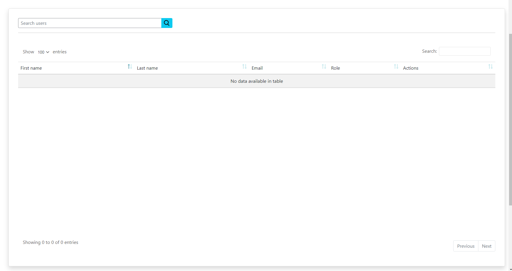
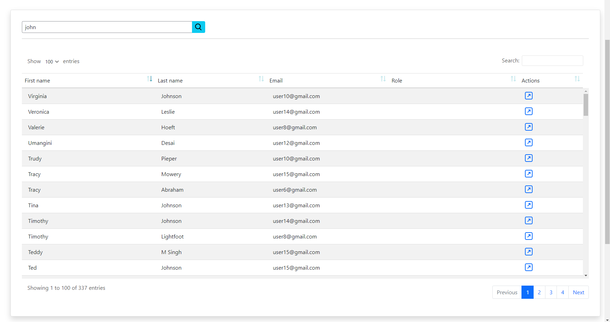

# Admin User Search
Contributors: usersearch
Donate link: https://adminusersearch.com
Tags: users
Requires at least: 5.0
Tested up to: 5.9
Stable tag: 1.0.2
License: GPLv3 or later
License URI: https://www.gnu.org/licenses/gpl-3.0.html

## Description

Search users in the wp-admin dashboard using firstname, lastname email and more -- including an increasing number of custom user fields/columns.

## Installation

1. Upload `admin-user-search.zip` to the `/wp-content/plugins/` directory
2. Activate the plugin through the 'Plugins' menu in WordPress

## Screenshots

1. Initial search UI 
2. Search results 

## Changelog

### 1.0.0
* Initial Release Candidate

### 1.0.1
* added progress bar
* show overall search results while retrieving user datas.
* optimized search for more accurate results.

### 1.0.2
* bug fixes
